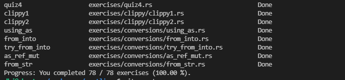

# Summer2021-No.113 完善StratoVirt在x86_64平台上的RTC设备模拟

[项目来源](https://gitee.com/openeuler-competition/summer-2021/issues/I3Q0Q5)

## 主要工作

#### 代码

* [正在做的的dev分支rtc代码](./source/rtc.rs)  
	目标是定时和报警、中断两个功能
	
	1. 给出了几个与中断相关的mc146818寄存器定义
	2. 给出了rtc_time 和 alarm 的数据结构
	3. 留出接口
	
	
	
* [x86myconfig](./source/x86myconfig) 在启动standard_vm的时候用的，增加/dev/rtc和/dev/rtc0
 

* [rustlingexercises](./source/rustlingexercises)  学习Rust的时候的一个小练习[rustlings源仓库链接](https://github.com/rust-lang/rustlings)，我给出的答案
 

#### 博客
* [源码编译OpenEuler-StratoVirt过程&&遇到问题及其解决方案](https://blog.csdn.net/qq_41675544/article/details/118734676?spm=1001.2014.3001.5501)
* [stratovirt的dev分支运行指南](https://blog.csdn.net/qq_41675544/article/details/119175267?spm=1001.2014.3001.5501)
* [为stratovirt的standard_vm编译openeuler的bzImage镜像](https://blog.csdn.net/qq_41675544/article/details/119281252?spm=1001.2014.3001.5501)
* [Linux Inside的计时器和时间管理章节阅读笔记1](https://blog.csdn.net/qq_41675544/article/details/119488579?spm=1001.2014.3001.5501)

